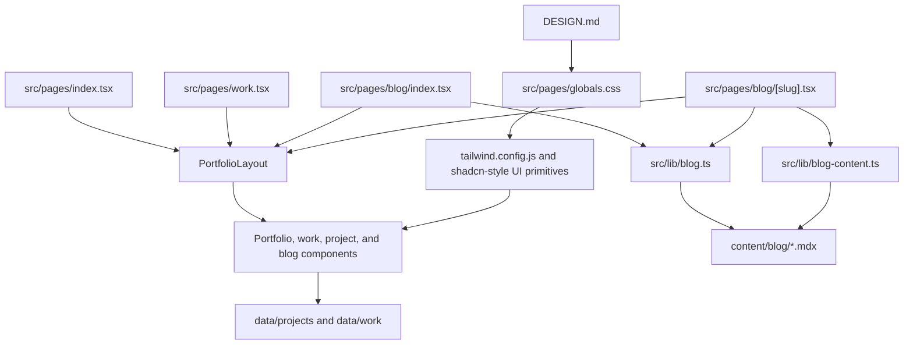

# Architecture

This repository is a single Next.js Pages Router frontend application. It renders Erick Barcelos' portfolio, work index, and local MDX blog without a backend API, database, authentication layer, or multi-package workspace.

## System Overview

## Application Type

- **Project type:** personal portfolio and blog.
- **Architecture size:** small to medium single frontend app.
- **Runtime:** Next.js with React.
- **Routing:** Pages Router under `src/pages`.
- **Content model:** local TypeScript data files plus local MDX posts.
- **Persistence:** no database or backend persistence is present.
- **API:** no `pages/api` routes are present.
- **Authentication:** no authentication or authorization system is present.

## Route Layer

| Route | File | Data source |
| --- | --- | --- |
| `/` | `src/pages/index.tsx` | `featuredProfessionalWork`, `featuredProjects`, `getLatestBlogPosts(3)` |
| `/work` | `src/pages/work.tsx` | `orderedProfessionalWork`, `orderedProjects` |
| `/blog` | `src/pages/blog/index.tsx` | `getAllBlogPosts()` |
| `/blog/[slug]` | `src/pages/blog/[slug].tsx` | `getStaticPaths`, `getBlogPostBySlug`, `getBlogPostComponent` |

The public blog routes are statically generated from published MDX files. Draft posts are filtered out unless the parser is explicitly called with `includeDrafts: true`.

## Shared Shell

`src/components/portfolio-shell.tsx` is the main composition layer. It owns:

- page-level metadata through `next/head`;
- the fixed header and primary navigation;
- the animated avatar/greeting behavior;
- the theme configuration menu;
- the framed editorial page layout;
- the footer contact links;
- shared section and collection primitives: `PortfolioSection`, `PortfolioSectionBody`, `PortfolioCollection`, and `PortfolioPageIntro`.

Navigation and footer link data come from `src/lib/portfolio-content.ts`.

## Content And Data Flow

### Professional Work

Professional work is stored in `data/work/professional-work.ts` and typed by `src/interface/IProfessionalWorkItem.ts`.

The data is intentionally public-safe and concise. Rendering is handled by `src/components/professional-work-card.tsx`.

### Independent Projects

Independent projects are stored in `data/projects/projects.ts` and typed by `src/interface/IProject.ts`.

Project cards use helpers from `src/lib/portfolio-content.ts`:

- `getProjectPrimaryLink` chooses the public link, source link, or package link;
- `getProjectSummary` uses short featured summaries where available;
- `getProjectStackPreview` formats a compact stack preview.

`src/components/featured-project-card.tsx` renders project cards and optional floating previews. Preview behavior can use local images or public project URLs in iframes, depending on `previewMode`.

### Blog Posts

Blog posts live in `content/blog/*.mdx`.

`src/lib/blog.ts` is the metadata source of truth:

- reads files from `content/blog`;
- ignores files whose names start with `_`;
- parses frontmatter with `gray-matter`;
- validates `title`, `summary`, `publishedAt`, `tags`, and `draft`;
- treats `coverImage` as optional;
- filters drafts from public routes;
- sorts posts by `publishedAt` descending.

`src/lib/blog-content.ts` uses `require.context` to load the matching MDX component module for a slug.

`src/components/blog/mdx-components.tsx` customizes rendering for prose, links, lists, blockquotes, tables, images, code blocks, and the optional `<Figure />` MDX component.

## Design And Theme Architecture

`DESIGN.md` is the visual source of truth. The implementation is concentrated in:

- `src/pages/globals.css` for `--portfolio-*` tokens, light/dark values, base styles, scrollbar styles, and portfolio CSS variables;
- `tailwind.config.js` for Tailwind aliases that expose portfolio tokens as utility classes;
- `components.json` for shadcn-style component configuration pointing to `src/pages/globals.css`;
- `src/pages/_app.tsx` for `ThemeProvider`, Geist Pixel Square, KaTeX CSS, Vercel Analytics, and Vercel Speed Insights;
- `src/pages/_document.tsx` for document language, favicon links, font variables, and browser translation hardening.

The theme model is class-based. `next-themes` toggles `light` and `dark` classes on the document root, while `src/pages/globals.css` changes the portfolio token values.

## External Services

The only external production integrations identified in the codebase are:

- Vercel Analytics via `@vercel/analytics/next`;
- Vercel Speed Insights via `@vercel/speed-insights/next`;
- public external links in project/contact data.

No external database, CMS, auth provider, payment provider, or API client is configured.

## Current Architectural Limitations

- There is no test suite or test script.
- Blog content is local-only and requires a code/content change to publish.
- Project previews can depend on external public URLs when `previewMode` is `iframe`.
- There is no preview mode or draft route for unpublished posts.
- Deployment is Vercel-oriented, but the exact production release workflow is not fully identified in the current codebase.
